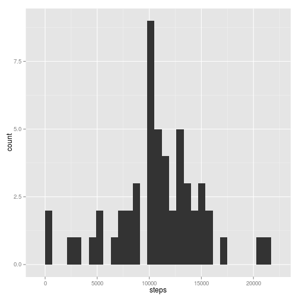
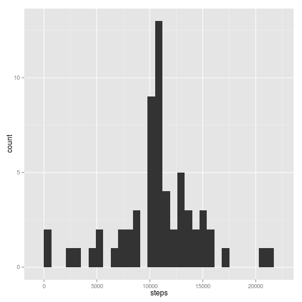
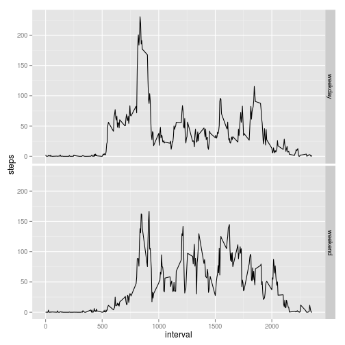

# Reproducible Research: Peer Assessment 1


## Loading and preprocessing the data


```r
unzip(zipfile = "activity.zip")
```


Then we read the dataset from the csv file


```r
observations <- read.csv("activity.csv")
```


and we transform the data type for the date variable

```r
observations$date <- as.Date(observations$date)
```


## What is mean total number of steps taken per day?

First we calculate the total number of steps per day


```r
steps_per_day <- aggregate(. ~ date, data = observations, sum)
```


We represent the histogram of the total number of steps per day with the ggplot2 package

```r
library(ggplot2)
qplot(steps, data = steps_per_day, binwidth = 700)
```

 

The mean of the total number of steps taken per day is calculated as follows:

```r
mean(steps_per_day$steps, na.rm = TRUE)
```

```
## [1] 10766
```

And the median total number of steps as:

```r
median(steps_per_day$steps, na.rm = TRUE)
```

```
## [1] 10765
```

## What is the average daily activity pattern?
First we aggregate the data by interval using the mean function.

```r
steps_per_interval <- aggregate(. ~ interval, data = observations, mean)
```

1. The timeseries is made with qplot

```r
qplot(interval, steps, data = steps_per_interval, geom = c("line"))
```

 

2. The interval that contains the maximum number of steps is calculated as:

```r
with(steps_per_interval, interval[steps == max(steps)])
```

```
## [1] 835
```


## Imputing missing values

1. Report the total number of missing values in the dataset, i.e. the total number of rows wit NAs


```r
sum(as.logical(rowSums(is.na(observations))))
```

```
## [1] 2304
```


2. Devise a strategy for filling in all of the missing values.
We will fill the missing values with the mean  for that interval.

3. Create a new dataset that is equal to the original with the filled values.

```r
filled_observations <- observations
for (i in 1:nrow(filled_observations)) {
    if (is.na(filled_observations[i, "steps"])) {
        fill_value <- steps_per_interval[steps_per_interval$interval == filled_observations[i, 
            "interval"], "steps"]
        filled_observations[i, "steps"] <- fill_value
    }
}
```

4. The histogram of the total number of steps per day with the filled data:

```r
filled_steps_per_day <- aggregate(. ~ date, data = filled_observations, sum)
qplot(steps, data = filled_steps_per_day, binwidth = 700)
```

 

Mean and median of the filled data:

```r
mean(filled_steps_per_day$steps)
```

```
## [1] 10766
```

```r
median(filled_steps_per_day$steps)
```

```
## [1] 10766
```

Do these values differ from the estimates from the first part of the assignment?
 -The mean with and withot na values is the same.
 -The median with and without na values only varies in 1 step.
What is the impact of imputing missing data on the estimates of the total daily number of steps?
it seems that filling the missing data does not have an impact in the stimations.

## Are there differences in activity patterns between weekdays and weekends?

1. Create a new factor variable in the dataset with two levels – “weekday” and “weekend” indicating whether a given date is a weekday or weekend day.

```r
filled_observations$day <- weekdays(filled_observations$date)
filled_observations[filled_observations$day == "Sunday" | filled_observations$day == 
    "Saturday", "day"] <- "weekend"
filled_observations[filled_observations$day != "weekend", "day"] <- "weekday"
filled_observations$day <- as.factor(filled_observations$day)
```


2. Make a panel plot containing a time series plot (i.e. type = "l") of the 5-minute interval (x-axis) and the average number of steps taken, averaged across all weekday days or weekend days (y-axis).


```r
steps_interval <- aggregate(steps ~ interval + day, data = filled_observations, 
    mean)

qplot(interval, steps, data = steps_interval, geom = c("line"), facets = day ~ 
    .)
```

 

